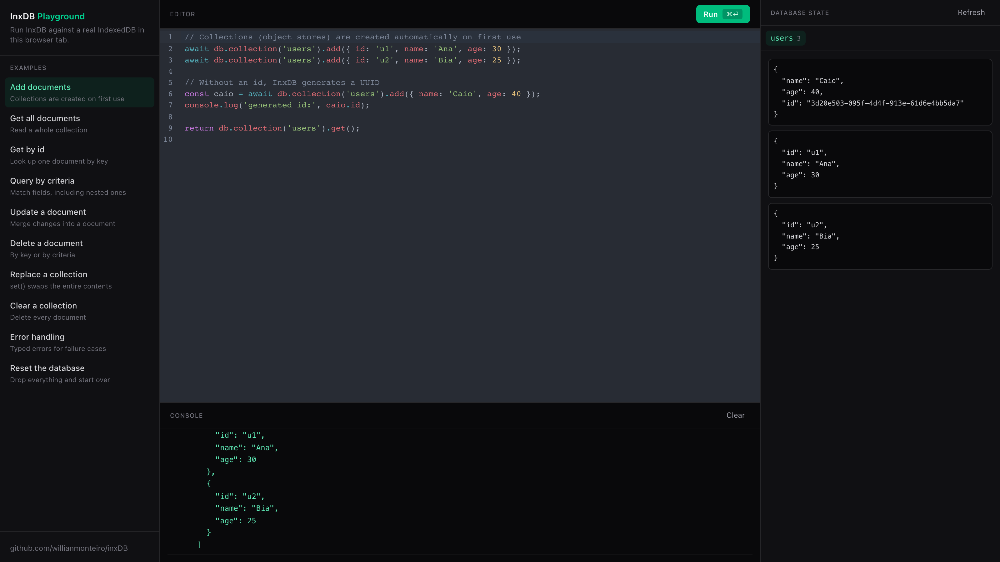

# InxDB Playground

An interactive playground for [InxDB](https://github.com/willianmonteiro/inxDB) — a promise-based IndexedDB wrapper with a document-store API.

**Live version: https://willianmonteiro.github.io/inxDB-playground/**

Write InxDB code in the editor, run it with `⌘⏎`/`Ctrl+Enter`, and watch it execute against a **real IndexedDB database** in your browser tab. Returned values and console output land in the console panel, and the database panel shows the live state of every collection and record.



## Features

- **Preset examples** covering the whole InxDB API: adding documents, reading, querying by (nested) criteria, updating, deleting, replacing collections, error handling, and resetting the database.
- **Code editor** (CodeMirror) with `db`, `InxDB`, and `console` in scope — write anything, `return` a value to print it.
- **Console panel** with color-coded output: results, logs, warnings, and errors.
- **Database panel** reading store and record state through the raw IndexedDB API, refreshed after every run.

Everything is local — the database lives in your browser's IndexedDB, nothing leaves the tab.

## Running locally

Requires Node 20+ (an `.nvmrc` is included).

```sh
nvm use
npm install
npm run dev
```

The playground uses the published [`inxdb`](https://www.npmjs.com/package/inxdb) package. To develop against a local checkout of the library instead, point the dependency at a sibling clone (`npm install ../inxDB`) and build it there first.

## Stack

- [Vite](https://vite.dev) + React + TypeScript
- [Tailwind CSS v4](https://tailwindcss.com)
- [CodeMirror 6](https://codemirror.net) (`@uiw/react-codemirror`)
- [InxDB](https://github.com/willianmonteiro/inxDB)

## License

MIT — see [LICENSE](LICENSE).
